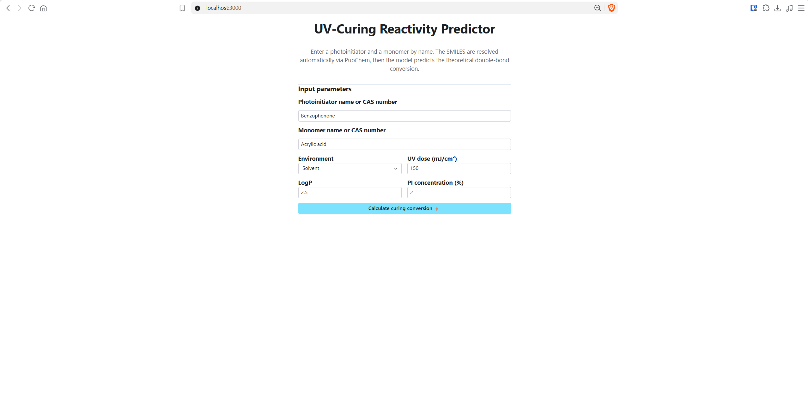

# UV-Curing Predictor and Photoinitiator Discovery

[](#)
[](https://github.com/ireneghioni-glitch/AI-Powered-UV-Curing-Predictor-and-PI-Discovery/releases/tag/v1.0.0)
[](https://ai-powered-uv-curing-predictor.reflex.run)
[](https://www.python.org/)
[](https://docs.conda.io/)
[](https://xgboost.readthedocs.io/)
[](https://www.rdkit.org/)
[](https://pytorch.org/)
[](https://becode.org/)

An end-to-end, full-stack Machine Learning and Cheminformatics platform designed to predict polymerization conversion percentage (**% Double Bond Conversion**) for UV-curable formulations and enable virtual screening for novel Photoinitiator (PI) discovery. Built with a modular 5-phase data pipeline, computer vision feature extraction, XGBoost gradient boosting, and an interactive **Reflex** web application.

> **Status Notice: Ongoing Development (Bootcamp Project)**  
> This project is currently under active development as part of the **BeCode AI & Data Science Bootcamp** (Specialization Phase). The MVP implementation is fully functional, with a comprehensive roadmap for industrial deployment, QSAR feature engineering, and closed-loop generative discovery.

* **Domain:** Cheminformatics, Photopolymer Chemistry, Computer Vision & Applied Machine Learning
* **Project Nature:** Solo Capstone Project (BeCode AI & Data Science Bootcamp)
* **Frameworks & Stack:** Python, RDKit, MobileNetV2 (TensorFlow/Keras), PyTorch, XGBoost, Scikit-Learn, Reflex, SQLModel

> **Deployment Note:** Cloud deployment via Reflex Cloud is planned for the next iteration. The application currently runs locally and is fully reproducible by following the setup instructions below.

<p align="center">
  
</p>

---

## Industrial Context & Note on Simulated Data

### The Industrial Bottleneck
In the formulation chemistry of UV-curable coatings, inks (3D printing, inkjet), and adhesives, achieving high double-bond conversion percentage ($\% \text{Conversion}$) is critical for mechanical strength, solvent resistance, and safety (preventing uncured monomer migration). However, experimental data on photoinitiator reactivity and industrial ink formulations are highly **proprietary and non-accessible** in public domains.

### Chemically Sound MVP Data Simulation
To overcome the lack of public experimental datasets while maintaining industrial relevance, the MVP dataset was generated using a **chemically and physically informed simulation engine**:
* **Radical Polymerization Kinetics:** Incorporates intrinsic photoinitiator efficiency (Type I unimolecular cleavage vs. Type II bimolecular hydrogen abstraction).
* **Monomer Reactivity & Steric Effects:** Models functionality (tri-acrylates > di-acrylates > mono-acrylates > methacrylates) and steric hindrance ($\alpha$-methyl group penalty).
* **Solubility & Medium Compatibility:** Integrates octanol-water partition coefficient ($\text{LogP}$) penalties for hydrophobic PIs in aqueous media ("like dissolves like").
* **UV Dose & Concentration Kinetics:** Implements first-order saturation curves for UV energy dose ($E_{\text{UV}}$) and a Beer-Lambert UV-shielding bell-shaped curve peaking at $3\%$ PI concentration.
* **Deterministic Full-Factorial Design:** Generates a $520,000$-row Design of Experiments (DoE) using MD5 hash-based deterministic seeds for full reproducibility across $560$ PI-monomer pairs under $1,000$ environmental conditions.

> **Transferability to Real Lab Data:**  
> The entire architecture (from PubChem API ingestion and RDKit pre-processing to PCA dimensionality reduction and XGBoost inference) is engineered specifically to accept real laboratory experimental data (e.g., FTIR spectroscopy curing curves) without structural modifications.

---

## Architecture & System Data Flow

```text
                               +----------------------------------+
                               |       MOLECULE IDENTIFIERS       |
                               |    (Trade Names / CAS Numbers)   |
                               +----------------------------------+
                                                |
                                                v
                               +----------------------------------+
                               |     shared/pubchem_client.py     |
                               | - Cache Lookup                   |
                               | - Manual Verified Dictionary     |
                               | - PubChem REST API (CID/SMILES)  |
                               +----------------------------------+
                                                |
                                                v
                               +----------------------------------+
                               |    shared/molecule_images.py     |
                               | - RDKit 2D Drawing Generation    |
                               | - Grayscale (224x224x1)          |
                               | - Augmentation (90°, 180°, 270°) |
                               +----------------------------------+
                                                |
                                                v
                               +----------------------------------+
                               |       phase2/extract_embed.py    |
                               | - Pretrained MobileNetV2 (Frozen) |
                               | - Global Average Pooling         |
                               | - 1280-D Visual Fingerprint      |
                               +----------------------------------+
                                                |
                                                v
                               +----------------------------------+
                               |   DATASET REDUCTION & DO E       |
                               | - 4-Rotation Augmentation Avg    |
                               | - PCA Compression (PI:51, Mono:9)|
                               | - 520k-Row Factorial Grid        |
                               +----------------------------------+
                                                |
                                                v
                               +----------------------------------+
                               |      phase4/train_xgboost.py     |
                               | - Tabular Concatenation          |
                               | - XGBoost Regressor (Early Stop) |
                               | - Output: % Conversion           |
                               +----------------------------------+
                                                |
                                                v
                               +----------------------------------+
                               |       inference/pipeline.py      |
                               | - Lazy Singleton Models          |
                               | - Sub-Second Runtime Inference   |
                               +----------------------------------+
                                                |
                                                v
                               +----------------------------------+
                               |      app/ (Reflex Frontend)      |
                               | - Interactive Prediction UI      |
                               | - SQLModel Audit Logging         |
                               +----------------------------------+
```

### System Workflow
1. **SMILES Resolution (`shared/pubchem_client.py`):** Resolves commercial trade names or CAS Registry Numbers (e.g., `Benzophenone` or `119-61-9`) into canonical SMILES strings via a three-tier hierarchy (Cache CSV $\rightarrow$ Curated Manual Dictionary $\rightarrow$ PubChem REST API).
2. **Image Generation (`shared/molecule_images.py`):** RDKit renders 2D molecular structures into $224 \times 224$ grayscale pixel grids with 4-fold rotational augmentation ($0^\circ, 90^\circ, 180^\circ, 270^\circ$).
3. **Computer Vision Feature Extraction (`phase2/`):** Pass molecular images through a frozen pre-trained **MobileNetV2** backbone on ImageNet. Global Average Pooling extracts a 1280-dimensional visual embedding per image.
4. **Dimensionality Reduction & DoE Alignment (`phase4/`):** Rotational augmentations are averaged per molecule. Principal Component Analysis (PCA) compresses 1280-D embeddings down to $51$ components for PIs and $9$ for monomers (preserving $100\%$ variance while reducing RAM usage by $98.7\%$).
5. **Tabular Machine Learning (`phase4/`):** Combines visual features with process parameters (`Is_Aqueous`, `LogP`, `%PI`, `UV_Dose`). Trains an **XGBoost Regressor** with early stopping, achieving $R^2 = 0.9860$ and $\text{MAE} = 1.15\%$.
6. **Inference Pipeline & Reflex Web App (`inference/`, `app/`):** Exposes `predict()` with lazy singleton model loading (30x speedup for warm requests) and a reactive web dashboard.

---

## Technical Implementation & Pedagogical Choices

### 1. The Computer Vision Choice (Pedagogical vs. Production)
* **Educational Context:** Feeding 2D molecular structure drawings into a Convolutional Neural Network (MobileNetV2) was implemented specifically to fulfill the **Data Science specialization** requirements of the BeCode Bootcamp (**Deep Learning & Computer Vision** content).
* **Production Reflection:** In pure chemical informatics, molecular graph representations (GNNs) or direct 2D/3D QSAR descriptors are computationally more direct than image-based CNN embeddings.
* **Future Computer Vision Repurposing:** In future iterations of this project, the Computer Vision module will be repurposed for physical laboratory images (e.g., contact angle sessile drop images for surface energy, optical microscopy of printed film thickness, or SEM cross-sections), while chemical embeddings transition to direct QSAR and graph representations.

### 2. XGBoost vs. Deep Learning Neural Network
* **Phase 3 PyTorch Baseline:** A Multi-Layer Perceptron (MLP) was constructed in PyTorch as an educational baseline ($R^2 \approx 0.42 - 0.88$ depending on synthetic noise).
* **Phase 4 XGBoost Dominance:** XGBoost proved vastly superior for tabular integration of embeddings and environmental variables, capturing non-linear interactions (e.g., LogP mismatch penalties in aqueous media) and reaching $R^2 = 0.9860$ and $\text{RMSE} = 1.58\%$.

### 3. Software Engineering & MLOps Best Practices
* **Training/Inference Contract:** Identical preprocessing (4-rotation averaging and PCA transformation matrices saved via `joblib`) is applied at inference time to prevent silent feature distribution drift.
* **Import Safety & Thread Safety:** All module-level batch code is protected with `if __name__ == "__main__":`, allowing clean imports in Reflex without triggering network calls. Thread-safe atomic CSV logging uses global locks (`threading.Lock`).

---

## 📁 Repository Structure

```text
AI-Powered-UV-Curing-Predictor-and-PI-Discovery/
├── app/                                  # Reflex web application
│   ├── pages/index.py                    # Interactive frontend dashboard
│   ├── app.py                            # Reflex main entry point
│   ├── models.py                         # SQLModel database schema (CuringLog)
│   └── state.py                          # Application state & event handlers
├── inference/                            # Runtime inference module
│   ├── __init__.py
│   └── pipeline.py                       # End-to-end predict() function with lazy singletons
├── shared/                               # Shared reusable core client
│   ├── __init__.py
│   ├── pubchem_client.py                 # Thread-safe PubChem API & cache client
│   └── molecule_images.py                # RDKit rendering & image preprocessing
├── phase1/                               # Phase 1: Ingestion & Image Generation
│   ├── fetch_molecules_PIs.py            # PI SMILES retrieval script
│   ├── fetch_molecules_monomers.py       # Monomer SMILES retrieval script
│   ├── generate_images_PIs.py            # PI 2D image rendering
│   ├── generate_images_monomers.py       # Monomer 2D image rendering
│   └── data/                             # Raw CSV data & metadata
├── phase2/                               # Phase 2: CV Feature Extraction
│   ├── extract_embeddings_PIs.py         # MobileNetV2 PI feature extraction
│   └── extract_embeddings_monomers.py    # MobileNetV2 Monomer feature extraction
├── phase3/                               # Phase 3: Deep Learning Core (Baseline)
│   ├── model.py                          # PyTorch CuringPredictorNet architecture
│   └── train_regressor.py                # PyTorch MLP training loop
├── phase4/                               # Phase 4: Tabular Integration & XGBoost
│   ├── train_xgboost.py                  # DoE, PCA & XGBoost training pipeline
│   ├── pca_pi.pkl / pca_mono.pkl         # Serialized PCA transformers
│   └── xgboost_model.json                # Serialized XGBoost model
├── phase.../docs/                        # Project documentation & logs
├── requirements-training.txt             # Explicit Python dependencies for chemvision_env
├── requirements-app.txt                  # Explicit Python dependencies for reflex_env
└── README.md                             # Repository documentation
```

---

## Local Setup & Deployment
This project uses **two isolated Python environments** because the training pipeline and the web application have conflicting dependency constraints (notably NumPy 1.x vs 2.x, and Python 3.9 vs 3.11).

| Environment | Python | Purpose | Dependencies file |
|---|---|---|---|
| `chemvision` | 3.9 | Phases 1–4: data ingestion, embeddings, model training | `requirements-training.txt` |
| `reflex_app` | 3.11 | Phase 5: Reflex web application, runtime inference | `requirements-app.txt` |

### 1. Clone Repository
```bash
git clone https://github.com/ireneghioni-glitch/AI-Powered-UV-Curing-Predictor-and-PI-Discovery.git
cd AI-Powered-UV-Curing-Predictor-and-PI-Discovery
```

### 2. Set Up the Training Environment (`chemvision`)
```bash
conda create -n chemvision python=3.9 -y
conda activate chemvision
pip install -r requirements-training.txt
```

### 3. Set Up the Application Environment (`reflex_app`)
**Dual-Environment Isolation:** The training pipeline and the web application are deliberately isolated into two conda environments with different Python versions (3.9 and 3.11). This resolves a hard dependency conflict: the CNN backbone requires NumPy 1.x for RDKit compatibility, while the Reflex web stack requires NumPy 2.x. Attempting to merge them into a single environment results in an irreconcilable dependency resolution failure. The dual-environment architecture mirrors the standard practice of separating offline training infrastructure from online serving infrastructure in production ML systems.
```bash
conda create -n reflex_app python=3.11 -y
conda activate reflex_app
pip install -r requirements-app.txt

# Node.js is required by Reflex to compile the frontend
conda install -c conda-forge "nodejs>=22.22" -y
```

### 4. Retrain the Model from Scratch  
Only needed if you want to regenerate xgboost_model.json, pca_pi.pkl, and pca_mono.pkl from raw data.  
```bash
conda activate chemvision

# Phase 1: fetch SMILES and generate molecular images
python -m phase1.fetch_molecules_PIs
python -m phase1.fetch_molecules_monomers
python -m phase1.generate_images_PIs
python -m phase1.generate_images_monomers

# Phase 2: extract CNN embeddings
python phase2/extract_embeddings_PIs.py
python phase2/extract_embeddings_monomers.py


# Phase 4: train XGBoost (PCA + DoE + early stopping)
python phase4/train_xgboost.py
```

### 5. Initialize Database & Launch the App
```bash
conda activate reflex_app

# Initialize Reflex DB and apply migrations
reflex db init
reflex db makemigrations --message "initial schema"
reflex db migrate

# Launch the web application
reflex run
```
Navigate to `http://localhost:3000` in your browser.

> **NOTE**:
> First prediction takes ~8 seconds (TensorFlow + MobileNetV2 + XGBoost are loaded lazily on the first request). Subsequent predictions complete in under 1 second thanks to module-level singleton caching.

---

## Roadmap & Next Steps

The project follows a structured post-MVP roadmap detailed in the `docs/` repository files:

1. **QSAR Descriptor Integration (`qsar-descriptor-integration-guide-en.md`):**  
   Transitioning from static factors to dynamic RDKit QSAR descriptors: Double Bond Density (DBD), SMARTS pattern matching for acrylates vs. sterically hindered methacrylates, and topological polar surface area.
2. **Dual-Model Formulation & Printing Window (`desired_prod_curing-and-formulation-prediction-pipeline.md`):**  
   Expanding into a dual-model system:
   * **Model 1 (Printing/Jetting):** Predicts blend viscosity ($\eta_{\text{mix}}$), surface tension ($\gamma_{\text{mix}}$), and calculates the Ohnesorge/Z-number printability window ($1 < Z < 10$).
   * **Model 2 (Curing):** Predicts double-bond conversion and cured film $T_g$.
   * **Multi-Objective Optimization:** Integrating **Optuna** Bayesian optimization to discover optimal ink compositions.
3. **Active Learning & Generative Discovery (`post-mvp-roadmap.md`):**  
   * **Active Learning:** Implementing Bayesian Optimization with Upper Confidence Bound (UCB) acquisition functions to select optimal experimental candidates.
   * **Generative Modeling:** Building a Variational Autoencoder (VAE) on SMILES for *in-silico* generation of novel photoinitiators.
   * **Closed-Loop Discovery:** Coupling generator, predictor, and acquisition function in an automated loop.
4. **Architecture & Engineering Enhancements:**  
   * **Config Externalization (`future-refactor-externalize-config.md`):** Externalizing molecule configuration into versioned JSON files.
   * **SQLModel Migration (`rx-model-to-sqlmodel-migration-guide.md`):** Migrating database models to pure `SQLModel` for Reflex 1.0 compatibility.
   * **Ecosystem Integration:** Synthesis route chatbot for newly discovered PIs and linking the tool to laboratory inventory/ERP software.
5. **Beyond CNN Embeddings: Graph and Transformer Architectures (Exploratory):**  
   The current pipeline relies on 2D image embeddings extracted via a pre-trained CNN. While pedagogically valuable and functionally effective, this is not the standard representation used in modern cheminformatics. Future iterations may explore complementary or alternative molecular encoders:  
   * **Graph Neural Networks (GNNs):** Represent molecules as graphs (atoms as nodes, bonds as edges) instead of images. GNNs preserve full molecular topology, avoid information loss from 2D rendering, and are considered the state-of-the-art approach for molecular property prediction. Common frameworks: **PyTorch Geometric**, **DGL**.  
   * **Pre-trained Chemical Transformers:** Models such as **ChemBERTa** and **MolFormer** are pre-trained on millions of SMILES strings and can serve as general-purpose molecular encoders for both property prediction and downstream generation tasks.  
   * **Generative Molecular Architectures:** Variational Autoencoders (VAEs) and diffusion models operating directly on molecular graphs or SMILES for *de novo* molecular design — the technical foundation for automated photoinitiator discovery.  

   These directions are not part of the immediate MVP roadmap, but they define the standard toolbox for advancing this project toward industrial-grade molecular discovery.
6. **User Interface & User Experience Optimization:**    
   The current Reflex interface is functional and pedagogically clear, but it was designed as an MVP demonstration rather than as a polished end-user product. Several known limitations remain:  
   * **First-Prediction Latency:** The initial request triggers TensorFlow, MobileNetV2, XGBoost, and PCA loading (~8 seconds), producing a visible delay for the first user. Improvement: warm up the lazy singletons during application startup, so that the first user does not pay the cost.  
   * **No Responsive Layout:** The form and result card are optimized for desktop only. Improvement: add Reflex responsive components (`rx.desktop_only`, `rx.mobile_and_tablet`) to ensure usability on tablets and mobile devices.  
   * **Minimal Error Feedback:** Failed lookups show a raw text message. Improvement: distinguish between "molecule not found", "CAS not registered in PubChem", "invalid input", and network errors with tailored messages and suggested corrections.  
   * **No Prediction History View:** Every prediction is logged in the `curinglog` database table, but the interface does not expose this data. Improvement: add a `/history` page with a filterable table of past predictions, useful for auditing and comparing formulation variants.  
   * **No Dark Mode Toggle:** `rx.theme(appearance="light")` is hardcoded. Improvement: expose a user-controlled light/dark toggle.  
   * **No Input Autocomplete:** Molecule names must be typed exactly (or resolved via CAS). Improvement: add an autocomplete dropdown populated from the existing `molecules_pis` and `molecules_monomers` CSV files, reducing typos and improving discoverability.    

   None of these items blocks the functional MVP, but together they represent the gap between a working prototype and a product that a formulation chemist would use daily without friction.

## Changelog

### v1.0.0 — 2026-09-12
First functional MVP release.
- End-to-end pipeline: SMILES → image → embedding → PCA → XGBoost
- 520,000-row full factorial dataset with deterministic simulation
- Reflex web app with lazy singleton inference (<1s warm requests)
- CAS number support via PubChem synonym lookup
- SQLModel audit logging of every prediction

<br>

<br>

---

<br>

#### Author
**Irene Ghioni**  
[AI & Data Science](https://becode.org/en/job-seekers/trainings/ai-data-science) Trainee at [BeCode Belgium](https://becode.org/) *(Specializing in Data Science)*  
[](https://www.linkedin.com/in/ireneghioni/) [](https://github.com/ireneghioni-glitch)
