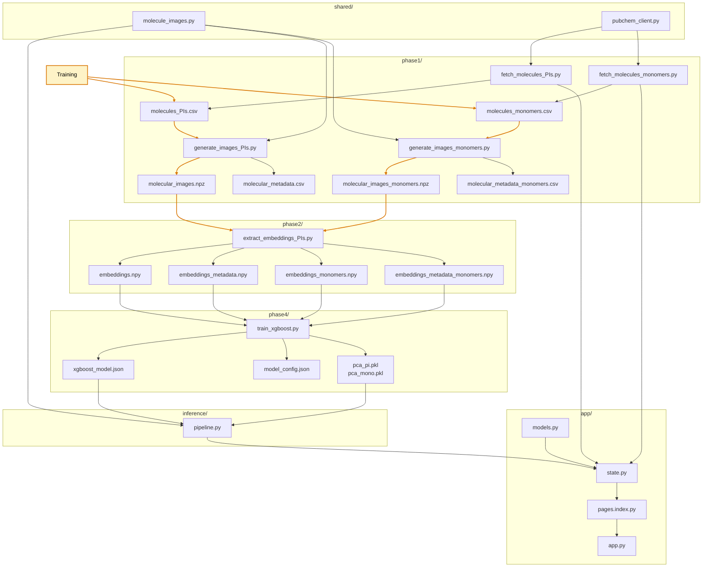

```mermaid
flowchart TD
	start_training[Training] --> M[molecules_PIs.csv]
	start_training --> L[molecules_monomers.csv]

	subgraph app/
		A[pages.index.py] --> B[app.py]
		C[models.py] --> D[state.py]
		D --> A
	end
	
	subgraph inference/
		E[pipeline.py]
	end
	
	subgraph shared/
		F[molecule_images.py]
		G[pubchem_client.py]
	end
	
	subgraph phase1/
		I[fetch_molecules_monomers.py] --> L
		L --> K[generate_images_monomers.py]
		H[fetch_molecules_PIs.py] --> M
		M --> J[generate_images_PIs.py]
		K --> Q[molecular_images_monomers.npz]
		J --> R[molecular_images.npz]
		K --> S[molecular_metadata_monomers.csv]
		J --> T[molecular_metadata.csv]
	end

	subgraph phase2/
		R --> U[extract_embeddings_PIs.py]
		Q --> U
		U --> V[embeddings.npy]
		U --> X[embeddings_metadata.npy]
		U --> W[embeddings_monomers.npy]
		U --> Y[embeddings_metadata_monomers.npy]
	end
	
	subgraph phase4/
		N[train_xgboost.py] --> O[xgboost_model.json]
		N --> Z[model_config.json]
		N --> P[pca_pi.pkl<br/>pca_mono.pkl]
		V --> N
		X --> N
		W --> N
		Y --> N
    end
	
	O --> E
	H --> D
	I --> D
	E --> D
	F --> E
	F --> J
	F --> K
	G --> H
	G --> I
	P --> E

	linkStyle 0 stroke:#d97706,stroke-width:2px
	linkStyle 1 stroke:#d97706,stroke-width:2px
	style start_training fill:#fef3c7,stroke:#d97706,stroke-width:2px,color:#000
	linkStyle 6 stroke:#d97706,stroke-width:2px
	linkStyle 8 stroke:#d97706,stroke-width:2px
	linkStyle 9 stroke:#d97706,stroke-width:2px
	linkStyle 10 stroke:#d97706,stroke-width:2px
	linkStyle 13 stroke:#d97706,stroke-width:2px
	linkStyle 14 stroke:#d97706,stroke-width:2px
```